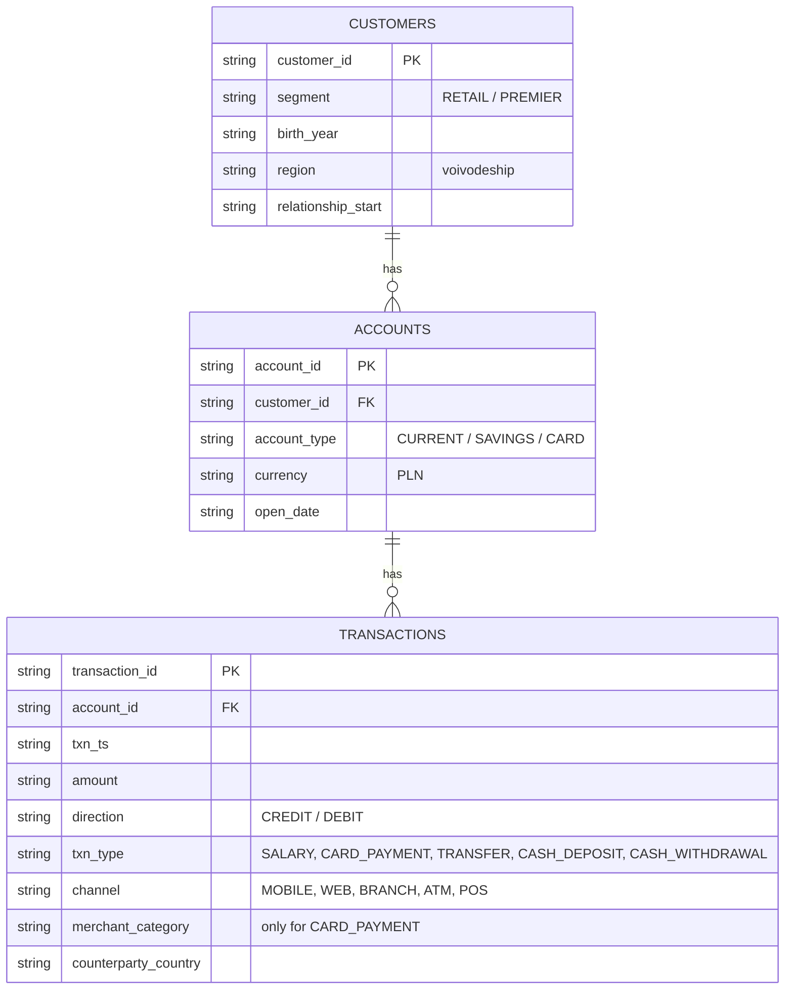

# Model danych GenericBank (landing / bronze)

Poza modelem: `ground_truth.csv` (customer_id, pattern, pattern_start): „prawda” o wstrzykniętych wzorcach, tylko do walidacji.
W bronze każda tabela ma dodatkowo `_source_file` i `_ingested_at`.
